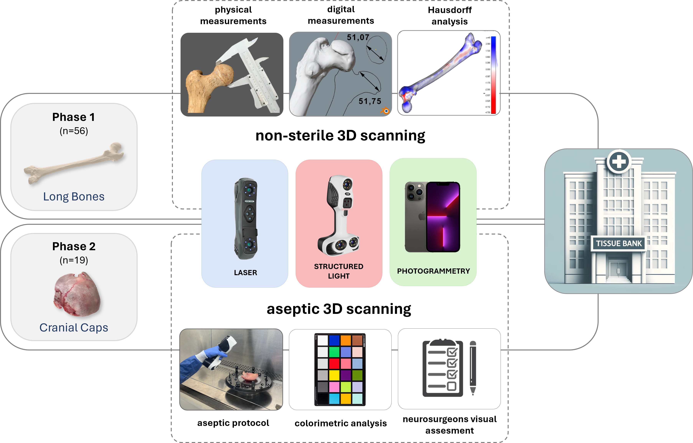

# 3D virtualization using high resolution scanner-based and photogrammetry technologies for bone bank digital modeling

### Anuar Giménez-El-Amrani1, Andres Sanz-Garcia2,3,4 *, Néstor Villalba-Rojas1, Vicente Mirabet5, Alfonso Valverde-Navarro6, Carmen Escobedo-Lucea 1,7 * 
1. BTELab. Fundación de Investigación del Hospital General Universitario de Valencia, Avda. Tres Cruces, 2, Pabellón B Planta 4, Valencia, 46014, Spain.
2. Department of Mechanical Engineering, University of Salamanca, 37007 Salamanca, Spain.
3. Institute of Biomedical Research of Salamanca (IBSAL), SACYL-University of Salamanca-CSIC, 37007 Salamanca, Spain
4. Unit of Excellence in Structured Light and Matter (LUMES), University of Salamanca, Spain
5. Cell and Tissue Bank, Centro de Transfusión de la Comunidad Valenciana, Avenida del Cid, 65-A, 46014, Valencia, Spain.
6. Department of Anatomy and Human Embryology, Faculty of Medicine and Odontology, University of Valencia, E-46010 Valencia, Spain
7. Wyss Institute for Biologically Inspired Engineering, Harvard University, Boston, MA 02115, USA.

Corresponding author's email: carmenescobedolucea@gmail.com and ansanz@usal.es 

    

## Supplementary Videos

#### Video S1. Photogrammetric 3D scanning workflow with a homemade motorized turntable.

    <video controls style="width: 100%; max-width: 640px; height: auto;">
        <source src="VideoS1_Motorized_Turntable.mp4" type="video/mp4">
    </video>

#### Video S2. 3D scanning using a structured light device with a homemade non-motorized turntable.

    <video controls style="width: 100%; max-width: 640px; height: auto;">
        <source src="VideoS2_Manual_Turntable.mp4" type="video/mp4">
    </video>

